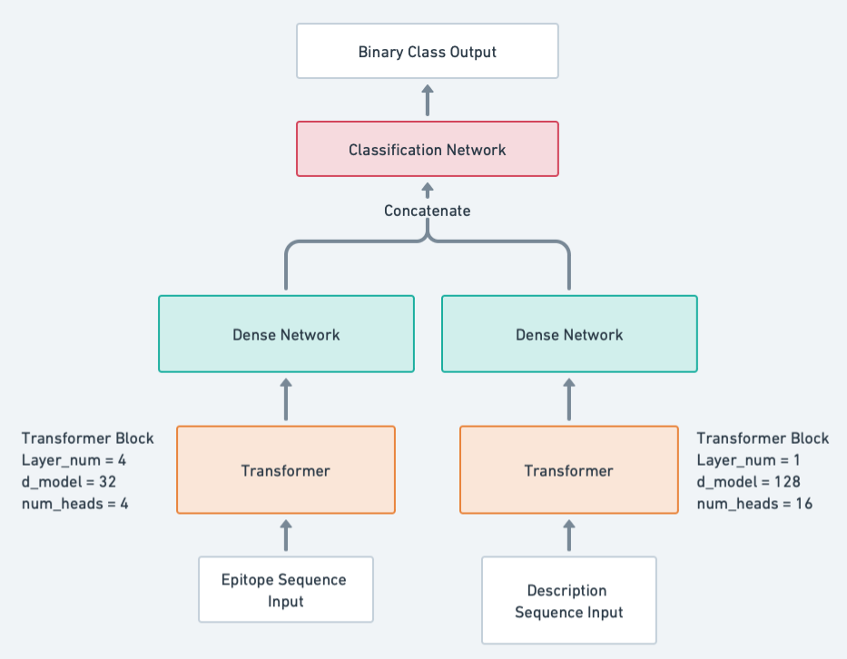

# MITNet and BioMITNet Implementation
Part of the project: [Predicting Systemic Lupus Erythematosus (SLE)-Associated Epitopes using Deep Learning](https://github.com/itsjustnilay/Epitope_Prediction_DL)  

*Project Summary*: Conducted a comparative study on deep learning models (ProtBERT, ReLSO, BEETLE, and MITNet) to predict the immunogenic potential of an epitope for SLE-related outcomes.  
*Contribution Statement*: Implement the model architecture of MITNet based on the [original paper](https://academic.oup.com/bib/article/24/4/bbad202/7186397). Constructed a new transformer-based architecture, **BioMITNet**, in PyTorch, which integrates epitope sequences and biological features, realizing an F1-score of 0.94 – a 32% improvement over the MITNet model.  
## File Directory
| **Filename**                     | **Description**                                                                 |
|-----------------------------------|---------------------------------------------------------------------------------|
| biomitnet_adamW_model.pth         | Pre-trained model file for BioMITNet using the AdamW optimizer.                 |
| biomitnet_adam_model.pth          | Pre-trained model file for BioMITNet using the Adam optimizer.                  |
| clean_data.csv                    | Cleaned dataset used for training and testing the models.                        |
| mitnet_adamw_model.pth            | Pre-trained MITNet model file using the AdamW optimizer.                        |
| performance_ctc_base.csv          | Performance of the MITNet only in CSV format.                      |
| performance_mitnet_all.csv        | Performance of MITNet and BioMITNet in CSV format.              |
| **test_model.ipynb**                  | Jupyter notebook for developing model architecture and testing - MITNet           |
| **test_model_bioinfo.ipynb**          | Jupyter notebook for developing model architecture and testing - BioMITNet             |

## BioMITNet Model Structure:

